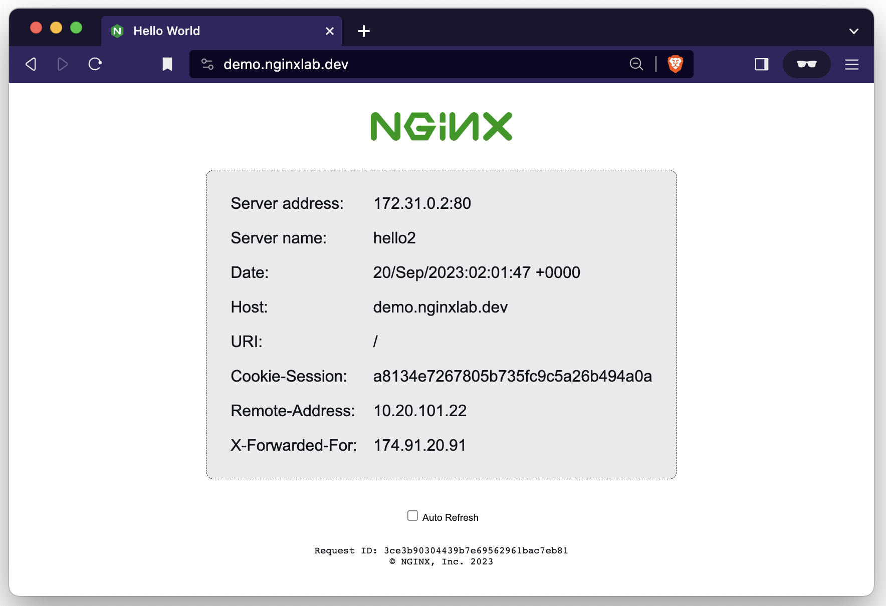

# NGINX webserver that serves a simple page containing its hostname, IP address and port as wells as the request URI and the local time of the webserver.

The images are uploaded to Docker Hub -- https://hub.docker.com/r/saifulmr/nginx-hello/.

How to run:
```
$ docker run -P -d saifulmr/nginx-hello
```

Now, assuming we found out the IP address and the port that mapped to port 80 on the container, in a browser we can make a request to the webserver and get the page below: 

A plain text version of the image is available as `saifulmr/nginx-hello:plain-text`. This version returns the same information in the plain text format:
```
$ curl <ip>:<port>
Server address: 172.17.0.2:80
Server name: hello1
Date: 19/Sep/2023:16:05:05 +0000
Host: demo.nginxlab.dev
URI: /
Cookie-Session: 
Remote-Address: 
X-Forwarded-For: 
Request ID: 48ba0db334a6ed165e783469c2af868f
```

The images were created to be used as simple backends for various load balancing demos.
